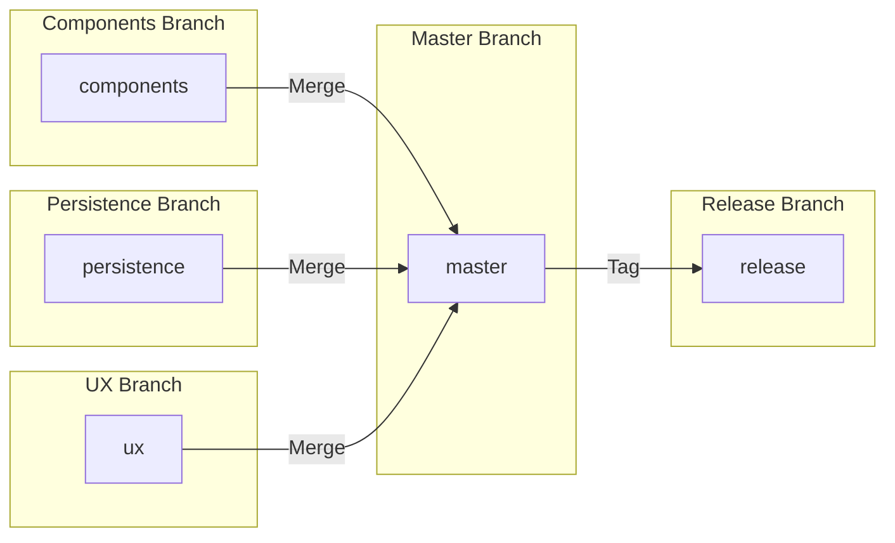

## Discussion of all functionality, including, if any, 3rd party and/or

- The App uses glide to display animated GIFs
- All data stored in Firebase
  - Places
  - Users
  - Images
- Can login using email/pass or Google OAuth
- Favourites Shown with a Start and updated on click
- Swipe to delete
- Swipe to camera


## Google APIs used.

- firebase
- glide
- picasso
- swiperefreshlayout
- timber

## UML & Class Diagrams:
```
+---------------------+      +---------------------+
|        User         |      |        Place        |
+---------------------+      +---------------------+
| - uid: String       |      |  - uid: String      |
| - email: String     |      |  - rating: String   |
| - places: List<Place>|<>----|  - country: String  |
| + createPlace(...)   |      |  - profilepic: String|
| + readPlace(...)     |      |  - isfav: Boolean?  |
| + updatePlace(...)   |      |  - email: String    |
| + deletePlace(...)   |      | + create()          |
+---------------------+      | + read()            |
                             | + update()          |
                             | + delete()          |
                             +---------------------+
```
## UX / DX Approach Adopted

-MVVM: This pattern ensures a clear separation of concerns, making our codebase modular and maintainable.

- Side Navigation Drawer: I incorporated a side navigation drawer to provide an intuitive and accessible user interface. The side nav enhances navigation flow, allowing users to explore the application.

- Aesthetics: Grren color schemes in reminder of the "Earth", typography, and GIFs elements contribute to user experience.

## Git approach adopted and link to git project / access, if any




## Personal Statement

In my current work, I was involved in a short-deadline project. I ended up prioritizing my work project over my assignment due to the possibility of being hired, so my performance on this module was not at its best.

## References

https://stackoverflow.com/

https://oguzhanaslann.medium.com/

https://developer.android.com/docs
